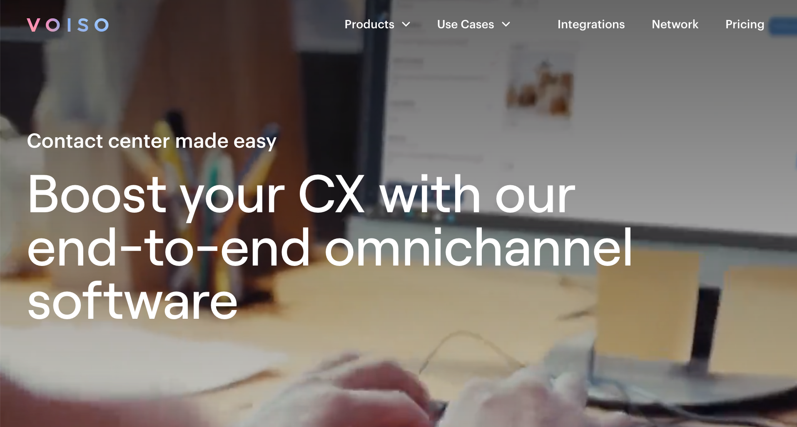
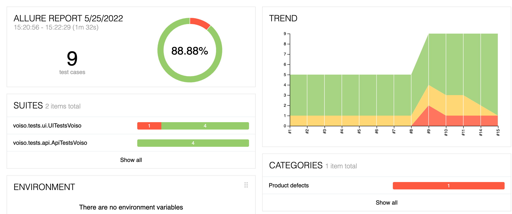
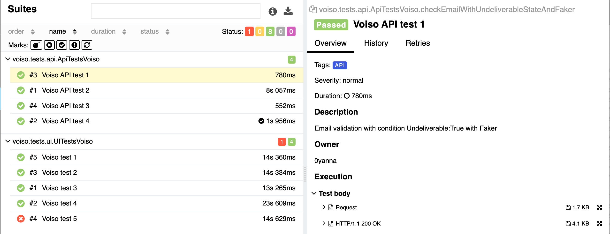
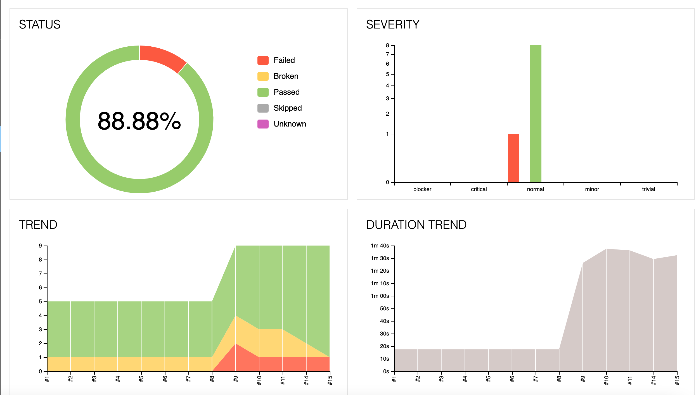
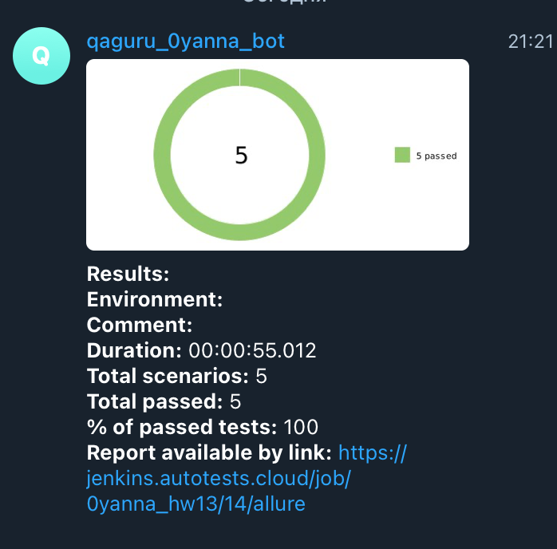

# Project of UI and API automation testing <a target="_blank" href="https://voiso.com/">voiso.com</a>



### :pencil: Content:
- :pushpin: [Test coverage](#bar_chart-Test-coverage)
- :pushpin: [Technology stack](#woman_technologist-Technology-stack)
- :pushpin: [Running tests from terminal](#black_large_square-Running-tests-from-terminal)
- :pushpin: [Allure report](#-Allure-report)
- :pushpin: [Telegram report](#-Telegram-report)


### :bar_chart:	Test coverage:
### :pencil2: UI:
> - [x] *Check if button 'request a demo' exists*
> - [x] *Check if video exists on the main banner*
> - [x] *Check title of the main page*
> - [x] *Check if blog page exists*
> - [x] *Page console log should not have errors*
> 
### :pencil2: API:
> - [x] *Email validation with condition Undeliverable:True with Faker*
> - [x] *Email validation with condition Disposable:True and models*
> - [x] *Email validation with condition Deliverable:True *
> - [x] *Invalid email and password verification with Lombok*


### :woman_technologist: Technology stack:
<p  align="center">
<a href="https://www.jetbrains.com/idea/"></a>
<a href="https://www.java.com/"></a>
<a href="https://github.com/"></a>
<a href="https://junit.org/junit5/"></a>
<a href="https://gradle.org/"></a>
<a href="https://selenide.org/"></a>
<a href="https://aerokube.com/selenoid/"></a>
<a href="https://github.com/allure-framework/allure2"></a>
<a href="https://www.jenkins.io/"></a>
<a href="https://www.telegram.com/"></a>
<a href="https://rest-assured.io/"></a>
<a href="https://projectlombok.org/"></a>
</p>

> In this project, autotests are written in <code>Java</code>, use <code>Selenide</code> for UI-tests and REST Assured for API-tests.
>
> <code>Selenoid</code> launches browsers in containers <code>Docker</code>.
>
> <code>Allure Report</code> generates a test run report.
>
> For automated building of the project, <code>Gradle</code> was used.
>
> Library for unit testing uses <code>JUnit 5</code>.
>
> <code>Jenkins</code> for runs tests
>
> Test run results are sent to <code>Telegram</code>.

### :black_large_square: Running tests from terminal:
:black_circle:	Local running tests
```
gradle clean test
```
:black_circle:	Remote running tests
```
clean
test
-DremoteUrl=${REMOTEURL}
-Dbrowser=${BROWSER}
-DbrowserVersion=${VERSION}
```
:black_circle: For running with task:
```
gradle clean UI_tests
gradle clean API_tests
```

:black_medium_small_square:	Build options
REPOSITORY
> <code>REMOTEURL</code> – address of the remote server the tests will run.
>
> <code>BROWSER</code> – browser will be used to run the tests  (_default - <code>chrome</code>_).
>
> <code>VERSION</code> – version of the browser will be used to run the tests (_default - <code>91.0</code>_).
>
> <code>BROWSER_SIZE</code> – size of the browser window will be used to run the tests (_default - <code>1920x1080</code>_).

### </a> <a target="_blank" href="https://jenkins.autotests.cloud/job/0yanna_hw13/allure/">Allure report</a>

Main window and build history


:spiral_notepad:	Test suite


:chart_with_downwards_trend:	Graphs


### </a> Telegram report


### Test execution example
<p align="center">
  
</p>